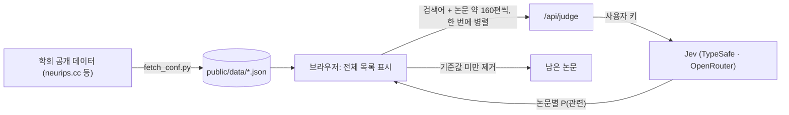

<div align="center">

# 📚 Find Papers

**학회 논문 수천 편을, 한 줄 검색으로 몇 초 만에 걸러내기**

NeurIPS · ICLR · ICML 채택 논문 전체를 [Jev](https://typesafe.ai)가 초록 단위로 직접 판정합니다.
임베딩 유사도가 아니라, 논문마다 "이 연구가 내 관심사에 맞는가?"를 확률로 답합니다.


-7c3aed)


</div>

---

## ✨ 특징

- **전수 판정** — 키워드·임베딩으로 미리 자르지 않고, 5,857편(NeurIPS 2025) 전체를 Jev가 읽고 판정합니다.
- **빠르고 싸다** — 전체 판정 **약 2초 · 약 $0.08** (실측).
- **줄어드는 화면** — 판정이 도착하는 대로 관련 없는 논문이 목록에서 빠져나갑니다.
- **좁히기** — 결과를 보고 조건을 덧붙이면 남은 논문만 다시 판정합니다 (비용 거의 0).
- **기준값 슬라이더** — 판정은 확률로 오기 때문에, 추가 호출 없이 엄격함을 조절할 수 있습니다.
- **내 PC에서, 내 키로** — 각자 로컬에서 실행합니다. 키는 내 브라우저와 내 PC의 로컬 서버만 거쳐 Jev로 갑니다.
- **메타데이터** — 제목 · 초록 · PDF 링크 · 트랙 · oral/spotlight/poster · 분야.
- **CSV 내보내기** — 남은 논문을 단계별 점수와 함께 저장합니다 (Excel에서 한글 그대로 열림).

## 🧭 동작 방식



Jev는 문장을 생성하지 않고 **판정만 반환하는 모델**입니다(TypeSafe의 "System-1" 모델).
검색어를 `state`로, 논문 약 160편(요청당 약 53k 토큰) 각각을 예/아니오 질문(`noul`)으로 한 번에 보내면, 질문마다 독립적으로 `P(예)`가 돌아옵니다.

## 🚀 빠른 시작

```bash
git clone https://github.com/yongukpark/find-papers.git
cd find-papers
npm install
npm run dev
```

http://localhost:3000 을 열고:

1. **키 선택** — TypeSafe 또는 OpenRouter 키를 넣습니다 (별명을 붙여 여러 개 저장 가능).
2. **학회 선택** — 목록에서 학회를 고릅니다.
3. **검색** — 찾고 싶은 연구 주제를 입력합니다.

> 환경변수는 필요 없습니다. 키는 화면에서 입력하고, 브라우저 localStorage에만 저장됩니다.
>
> Node.js 20 이상이 필요합니다. 학회 데이터(`public/data`)는 저장소에 포함되어 있어 바로 쓸 수 있습니다.

### API 키 발급

| 제공자 | 발급 | 모델 | 비고 |
|---|---|---|---|
| OpenRouter | [openrouter.ai/keys](https://openrouter.ai/keys) | `typesafe/jev-1.13` | 가입 즉시 사용 가능. 키별 사용 한도 설정 권장 |
| TypeSafe | [console.typesafe.ai/keys](https://console.typesafe.ai/keys) | `jev-latest` | 신규 가입이 일시 중단된 적 있음 |

## 📊 지원 학회

| 학회 | 논문 수 | 트랙 |
|---|---:|---|
| NeurIPS 2025 | 5,857 | Main · Datasets & Benchmarks · Position · Journal |
| NeurIPS 2024 | 4,537 | Main · Datasets & Benchmarks · Journal |
| ICLR 2025 | 3,830 | Main · Blog Posts · Journal |
| ICML 2025 | 3,339 | Main · Position · Journal |

Workshop 논문은 포함하지 않습니다 (OpenReview 로그인 필요).
ICLR 2026 · ICML 2026은 공개 데이터에 초록이 없어 아직 제외했습니다.

### 학회 추가

```bash
python3 scripts/fetch_conf.py icml 2025   # → public/data/icml2025.json, index.json 갱신
```

같은 플랫폼(miniconf)을 쓰는 `neurips` · `iclr` · `icml` 은 모두 동작합니다. 표준 라이브러리만 사용합니다.

## 🎯 정확도 (실측)

NeurIPS 2025에서 "mechanistic interpretability → LLM"으로 좁혀 찾고, 직접 판정한 정답과 비교했습니다 (정답 100편).

| 검색 방식 | precision | recall | F1 |
|---|---:|---:|---:|
| 짧은 검색어, 2단계 좁히기 | 0.68 | 0.80 | 0.74 |
| 짧은 검색어, 한 번에 | 0.67 | 0.82 | 0.74 |
| **구체적인 검색어, 한 번에** (기준값 0.65) | **0.87** | **0.88** | **0.88** |

- **검색어를 구체적으로 쓸수록 정확합니다.** 단계를 나누는 것보다 효과가 큽니다.
  예: `mechanistic interpretability of LLMs — circuits, SAE features, probing hidden activations`
- 점수는 잘 보정되어 있습니다. 짧은 검색어 1단계에서 0.9 이상은 precision 0.98.
- 정답은 사람이 아닌 Claude가 고정된 기준으로 판정한 것이므로 참고용입니다.

## 💰 비용

| 작업 | 토큰 | 비용 |
|---|---:|---:|
| 첫 검색 (5,857편) | 약 180만 | 약 $0.08 |
| 좁히기 (남은 500편) | 약 15만 | 약 $0.006 |

Jev 가격: 입력 $0.042 / 100만 토큰, 출력 무료.

## 🗂 프로젝트 구조

```
find-papers/
├── app/
│   ├── page.tsx                  # 키 선택 (별명 · 여러 키)
│   ├── conferences/page.tsx      # 학회 선택
│   ├── conferences/[id]/page.tsx # 검색 · 줄어드는 목록 · 기준값 슬라이더
│   └── api/judge/route.ts        # 논문 묶음 → Jev 호출 → {id: 확률}
├── lib/key.ts                    # 브라우저 키 저장소
├── public/data/                  # 학회별 논문 JSON + index.json
└── scripts/fetch_conf.py         # 학회 데이터 수집
```

DB도 벡터 DB도 없습니다. 논문 데이터는 정적 JSON이고, 로컬 서버는 키를 전달하는 얇은 프록시뿐입니다.

## 🏠 왜 로컬 전용인가

Jev 호출은 `/api/judge`(Next.js 서버)를 거칩니다. TypeSafe API가 브라우저 직접 호출(CORS)을 막고 있어서입니다.
이 서버를 공개 배포하면 **다른 사람의 키가 배포자의 서버를 지나가게** 되므로, 각자 자기 PC에서 실행하는 방식을 택했습니다.
로컬에서는 그 서버가 곧 내 PC이므로 키가 외부 제3자를 거치지 않습니다.

## 🔒 키 보관

- 키는 **브라우저 localStorage**에만 평문으로 저장됩니다 (`find-papers-keys`).
- 검색할 때마다 내 PC의 `/api/judge`를 거쳐 Jev로 전달되며, 저장하거나 기록하지 않습니다.
- 공용 PC에서는 사용 후 키를 삭제하세요. 사용 한도를 건 키를 권장합니다 (OpenRouter는 키별 한도 설정 가능).

## 🛣 로드맵

- [ ] Workshop 논문 (OpenReview 로그인 수집)
- [ ] ICLR 2026 · ICML 2026 초록 수집
- [x] 결과 CSV 내보내기
- [ ] BibTeX 내보내기
- [ ] 여러 학회 동시 검색
