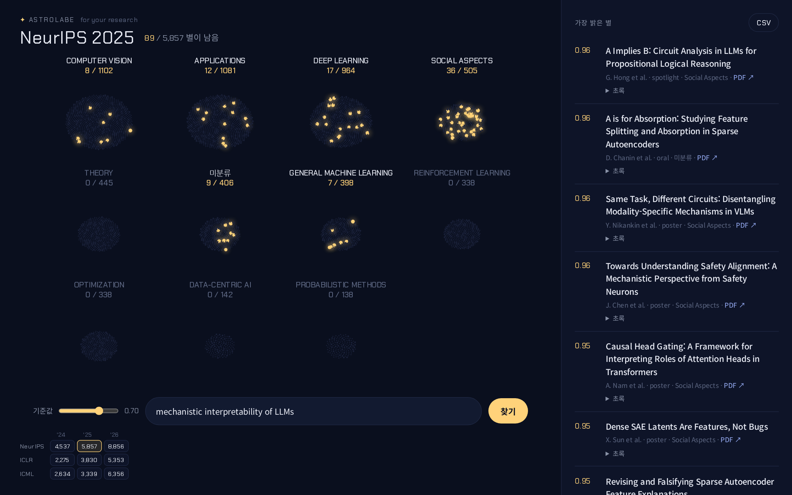
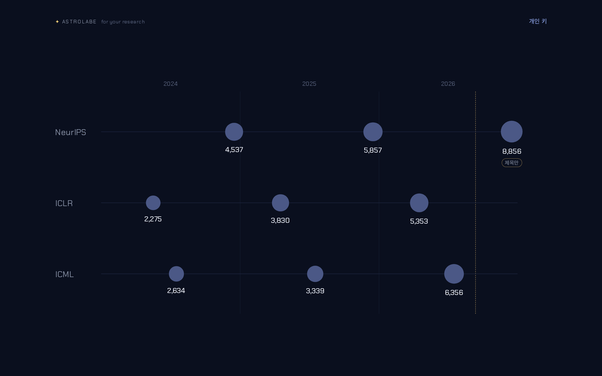

<p align="center">
  
</p>

<p align="center">
  학회 채택 논문 전체를 별자리로 펼치고, 내 연구 주제에 맞는 논문만 빛나게.
</p>

<p align="center">
  
  
  
</p>

---

학회마다 수천 편씩 쏟아지는 채택 논문에서 내 주제와 맞는 것만 추리는 도구입니다.
키워드 매칭이나 임베딩 유사도 대신, [Jev](https://typesafe.ai)가 **논문 한 편 한 편의 초록을 읽고** "이 연구가 이 주제에 해당하는가"를 확률로 판정합니다.

<p align="center">
  
</p>

- **학회 전체를 한 번에** — NeurIPS 2025 5,857편을 약 2초, 약 $0.08에 판정합니다.
- **분야별 별자리** — 학회가 매긴 분야대로 논문이 별 무리를 이루고, 판정을 통과한 논문만 빛납니다. 어느 분야에 몰려 있는지가 한눈에 보입니다.
- **기준값 슬라이더** — 판정이 확률로 오기 때문에 다시 호출하지 않고 엄격함을 조절합니다. 결과는 CSV로 내보낼 수 있습니다.
- **내 PC에서, 내 키로** — 각자 로컬에서 실행하고, 키는 내 브라우저와 내 PC의 로컬 서버만 거칩니다.

<p align="center">
  
</p>

## 실행

Node.js 20 이상이 필요합니다.

```bash
git clone https://github.com/yongukpark/astrolabe.git
cd astrolabe
npm install
npm run data       # 학회 논문 데이터 받기 (약 15초~1분)
npm run dev        # http://localhost:3000
```

1. Jev API 키를 넣습니다 — [OpenRouter](https://openrouter.ai/keys) 또는 [TypeSafe](https://console.typesafe.ai/keys).
2. 연표에서 학회를 고릅니다.
3. 연구 주제를 입력합니다. 포함하거나 빼고 싶은 것까지 구체적으로 적을수록 정확합니다.
   예: `mechanistic interpretability of LLMs — circuits, SAE features, probing hidden activations`

## 지원 학회

|  | 2024 | 2025 | 2026 |
|---|---:|---:|---:|
| **NeurIPS** | 4,537 | 5,857 | 8,856 ※ |
| **ICLR** | 2,275 | 3,830 | 5,353 |
| **ICML** | 2,634 | 3,339 | 6,356 |

※ NeurIPS 2026은 초록과 분야가 아직 공개되지 않아 **제목만으로** 판정합니다. 초록이 있을 때보다 정확도가 크게 낮습니다 (NeurIPS 2025 기준 F1 0.88 → 0.60).

## 키 보관

- 키는 브라우저 localStorage에만 평문으로 저장됩니다.
- 검색할 때 내 PC의 로컬 서버(`/api/judge`)를 거쳐 Jev 제공자에게만 전달되고, 저장하거나 기록하지 않습니다.
- 이 서버를 공개 배포하면 다른 사람의 키가 배포자 서버를 지나가게 되므로, 각자 로컬에서 실행하는 것을 전제로 합니다.

## 데이터 출처

| 데이터 | 출처 | 비고 |
|---|---|---|
| 채택 논문 목록 · 제목 · 저자 · 초록 · 발표 형태 · 분야 | 각 학회 공식 사이트의 공개 데이터<br>`neurips.cc` · `iclr.cc` · `icml.cc` `/static/virtual/data/<학회>-<연도>-orals-posters.json` | 수집: `scripts/fetch_conf.py` |
| ICLR 2026 · ICML 2026 초록 보강 | [papercopilot/paperlists](https://github.com/papercopilot/paperlists) | 공식 데이터에 초록이 없는 경우에만 사용. 해당 저장소에는 라이선스가 명시되어 있지 않음 |
| NeurIPS 2026 | 공식 공개 데이터 (2026-09-26 받음) | 초록 · 분야 · PDF 미공개. 공개되면 다시 받으면 됨 |
| 논문 링크 · PDF | [OpenReview](https://openreview.net), [NeurIPS Proceedings](https://proceedings.neurips.cc) | 링크만 저장하며 PDF는 저장하지 않음 |
| 개최 시기 (월) | 각 학회 공식 사이트 | `public/data/index.json`에 수기 입력 |

논문 데이터(제목 · 초록 등)는 **이 저장소에 포함되어 있지 않습니다.** `npm run data`가 위 공개 출처에서 각자의 PC로 직접 받습니다. 저장소에는 학회 목록(`public/data/index.json`)과 수집 스크립트만 있습니다.

```bash
npm run data                                     # public/data/index.json의 학회 전부
python3 scripts/fetch_conf.py neurips 2025       # 한 학회만
python3 scripts/fetch_conf.py neurips 2026 data/raw/neurips-2026-orals-posters.json   # 받아 둔 파일로
```

## 권리 고지

- **논문 내용:** 논문 제목과 초록의 저작권은 각 저자와 해당 학회 · 출판사에 있습니다. 이 저장소는 논문 데이터를 담거나 재배포하지 않으며, 사용자가 개인 연구용 검색을 위해 공개 출처에서 직접 받습니다. 받은 데이터를 다시 배포하려면 각 출처의 이용 조건을 먼저 확인하세요.
- **학회 명칭:** NeurIPS, ICLR, ICML은 각 주최 재단의 명칭입니다. 이 프로젝트는 어느 학회와도 관련이 없습니다.
- **모델:** 판정은 TypeSafe의 Jev 모델을 사용자 본인의 키로 호출해 이뤄지며, 각 제공자([TypeSafe](https://typesafe.ai), [OpenRouter](https://openrouter.ai))의 이용 약관을 따릅니다.
- **이미지:** `docs/`의 배너와 스크린샷은 이 프로젝트에서 직접 만든 것입니다. 스크린샷 속 논문 제목은 NeurIPS 2025 공개 데이터입니다.
- **글꼴:** [Chakra Petch](https://fonts.google.com/specimen/Chakra+Petch), [Noto Sans KR](https://fonts.google.com/noto/specimen/Noto+Sans+KR) — SIL Open Font License 1.1, Google Fonts에서 불러옵니다.
- **라이브러리:** [Next.js](https://github.com/vercel/next.js) · [React](https://github.com/facebook/react) (MIT).
